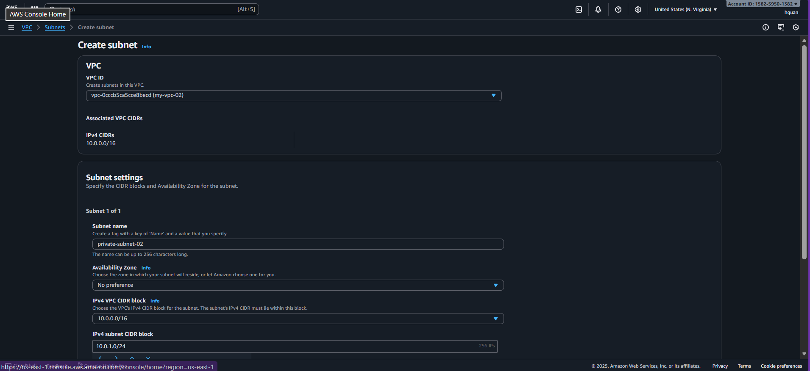
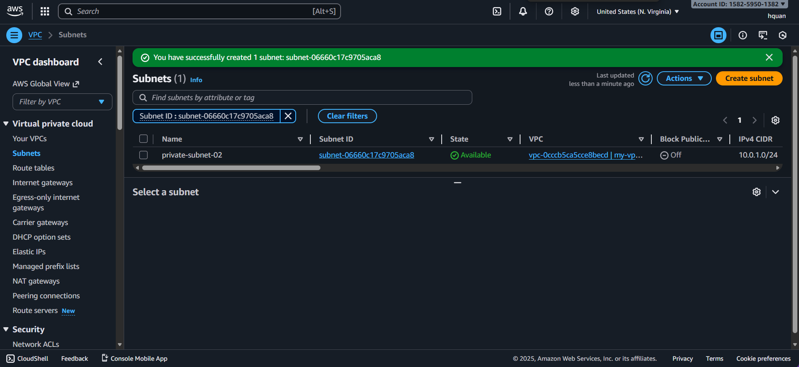
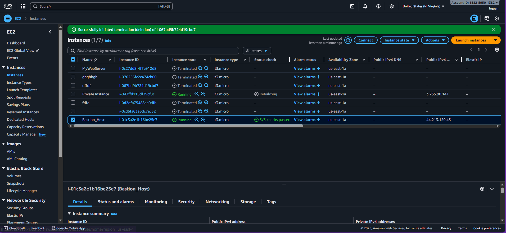
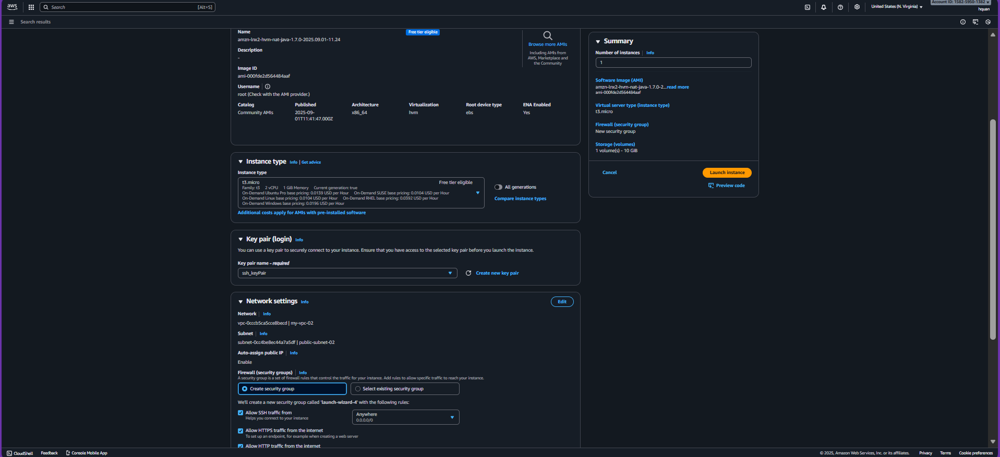
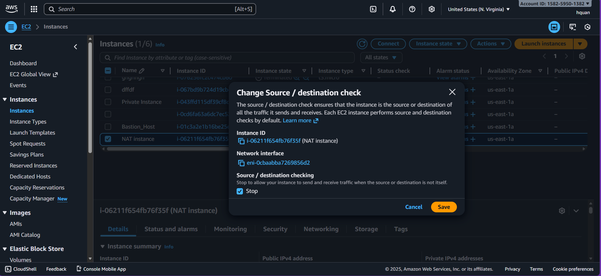
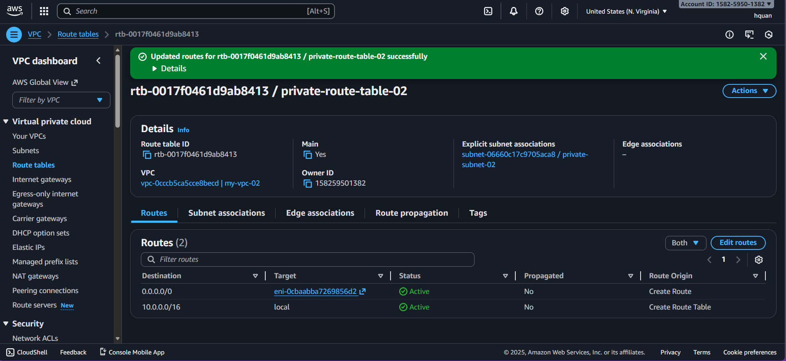

# Navigate to VPC to create a private subnet

1. create a private subnet, without public IP assignment, settings like image, scroll to the bottom, click **Create subnet**

2. successfully

3. create a ec2 instance named "Bastion host" in "public-subnet-02", and a ec2 instance in "private-subnet-02" with the settings like below

4. create a NAT instance, with the settings like below

5. turn off the "Change Source/ destination check" of the **Nat instance**

6. create "private-route-table-02", in the "subnet association", add "private-subnet-02", with the route like below

